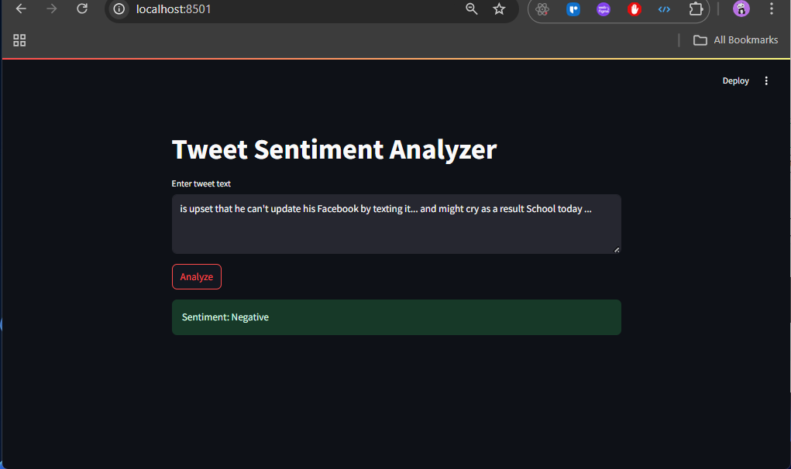

# Tweet Sentiment Dashboard

A real-time Tweet sentiment analysis service with:

- **Model training**: TF-IDF + Logistic Regression  
- **API**: FastAPI serving `/sentiment` endpoint  
- **Dashboard**: Streamlit UI for live analysis  
- **Containerized**: Docker + Docker Compose  
- **Deployment**: Instructions for AWS EC2

---
## ⚙️ Prerequisites

- Docker & Docker Compose  
- (Optional) Python 3.8+ for local training  
- AWS EC2 account for deployment

---

## 🚀 Getting Started

1. **Train the model** (optional, if you need to retrain):

   ```bash
   cd model
   pip install pandas scikit-learn
   python train_sentiment.py
   # produces sentiment_model.pkl

2. **Build & run with Docker Compose:**
    from project root
docker-compose up --build -d

3. **Access services:**

FastAPI Swagger UI → http://localhost:8000/docs

Streamlit dashboard → http://localhost:8501

4. **Stop :**
docker-compose down

---
## Output SS



